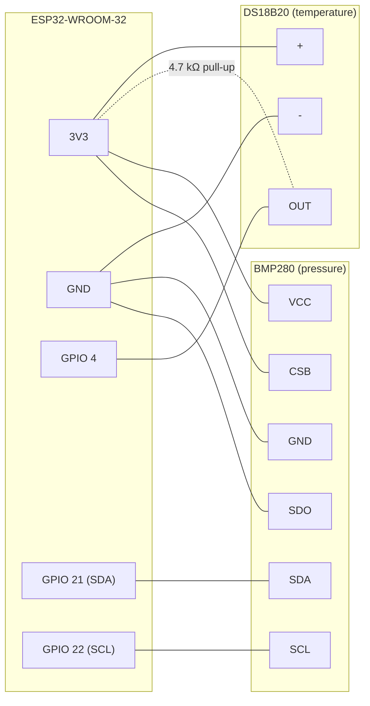

# IRL Hardware Demo — ESP32 + DS18B20 + BMP280

The hardware demo streams **real sensor readings** into the same
`POST /events/` pipeline the dataset replay uses, so the dashboard shows
live model predictions on physical inputs. Heat the DS18B20 (finger,
hairdryer) to push toward `overheat`; press/blow on the BMP280 to push
`pseudo_pressure_pa` toward `pressure_fault`.

```
   ┌────────────┐   1-Wire    ┌──────────────────┐   WiFi/HTTP   ┌──────────────────┐
   │  DS18B20   ├────────────►│                  │   GET /reading │                  │
   │ (heat)     │             │  ESP32-WROOM-32  │◄───────────────┤ hw_demo_bridge.py │
   └────────────┘             │  HTTP JSON API   │                │  (synthesizes the │
   ┌────────────┐    I2C      │  port 80, mDNS   │                │  other channels)  │
   │  BMP280    ├────────────►│  dtx-esp32.local │                └────────┬─────────┘
   │ (pressure) │             └──────────────────┘                POST /events/
   └────────────┘                                                          ▼
                                                              FastAPI → AI pipeline → dashboard
```

## 1. Parts

| Part | Pins used |
| --- | --- |
| ESP32-WROOM-32 dev board | 3V3, GND, GPIO 4, GPIO 21, GPIO 22 |
| DS18B20 temperature sensor | `+`, `-`, `OUT` |
| BMP280 pressure module | `VCC`, `GND`, `SCL`, `SDA`, `CSB`, `SDO` |
| 4.7 kΩ resistor | pull-up between DS18B20 `OUT` and 3V3 |

## 2. Wiring diagram



| Connection | Why |
| --- | --- |
| DS18B20 `OUT` → GPIO 4 with 4.7 kΩ to 3V3 | 1-Wire bus needs the pull-up; without it readings fail (`-127 °C`) |
| BMP280 `CSB` → 3V3 | selects **I2C** mode (low = SPI) |
| BMP280 `SDO` → GND | sets I2C address `0x76` (the firmware also probes `0x77` as fallback) |
| BMP280 `SCL`/`SDA` → GPIO 22/21 | ESP32 default I2C pins |

## 3. Flash the firmware

Everything that runs on the ESP32 lives under `HW/` (PlatformIO project):

```bash
cd HW
cp include/wifi_config.example.h include/wifi_config.h
#   → edit SSID / password (file is gitignored)
pio run -t upload
pio device monitor          # 115200 baud — note the IP address
```

The node serves:

| Endpoint | Payload |
| --- | --- |
| `GET /health` | `{"status":"ok","uptime_ms":…,"wifi_rssi_dbm":…,"ds18b20_ok":…,"bmp280_ok":…}` |
| `GET /reading` | `{"temperature_c":…,"pressure_pa":…,"bmp280_temperature_c":…,"sequence":…}` |

mDNS name: `http://dtx-esp32.local` (falls back to the DHCP IP shown on the
serial monitor if your network blocks mDNS).

## 4. Channel mapping — how 2 real sensors feed a 19-channel model

The models consume the dataset's 19 telemetry channels. In the source
simulation every channel except `power_dissipated_w` is itself a derived
quantity, so the bridge (`scripts/hw_demo_bridge.py`) reconstructs the
vector as follows:

| Channel | Source |
| --- | --- |
| `temperature_c` | **real** — DS18B20 reading, used as-is |
| `pseudo_pressure_pa` | **real** — `(BMP280 − startup baseline) × --pressure-gain` (default 200). The dataset's pseudo-pressure is a hydraulic *delta* in the ±tens-of-kPa range while the BMP280 sits at ~101 kPa absolute; the gain maps a small physical stimulus into the fault range |
| `power_dissipated_w` | **derived** — nominal median + `--power-per-degree` (default 40 W/°C) for every °C above the startup temperature baseline, mimicking the overheat power signature |
| remaining 16 channels | **synthesized** — nominal-class median + small Gaussian jitter (5 % of the nominal std), computed from the *training pool only* |

Consequence: classification during the IRL demo is driven by the two real
sensors. Faults whose signatures live in synthesized channels
(`bearing_wear`, `wheel_slip`, `overload`) will not trigger from hardware
stimuli — expected and documented behaviour for a 2-sensor rig.

Every hardware event carries `metadata.source = "hardware_demo"` plus the
raw reading, baselines, and the real/derived/synthesized channel lists, so
the dashboard and any later analysis can tell IRL events from replay events.
No ground-truth labels are attached: IRL events do not affect
replay-accuracy metrics.

## 5. Run the demo

**From the dashboard (recommended):** open the **AI Validation** page →
*Demo Control* panel → pick **IRL demo (ESP32)** → set the ESP32 URL →
**Start**. The backend launches the bridge; *Stop* terminates it. Pick
**Dataset demo** in the same panel to replay the leakage-safe holdout
instead.

**From the CLI:**

```bash
# backend must be running (bash scripts/run_dev.sh)
python scripts/hw_demo_bridge.py \
    --esp32-url http://dtx-esp32.local \
    --model lightgbm \
    --interval 1.0
```

Useful knobs: `--pressure-gain` (how hard a pressure stimulus hits the
model), `--power-per-degree` (how strongly heating couples into
`power_dissipated_w`), `--count N` (stop after N events).

## 6. Troubleshooting

| Symptom | Fix |
| --- | --- |
| `temperature_c` is null / −127 °C | missing 4.7 kΩ pull-up, or `OUT` not on GPIO 4 |
| `bmp280_ok: false` | `CSB` must be tied to 3V3 (I2C mode); check SDA/SCL not swapped |
| bridge: "ESP32 unreachable" | mDNS blocked → use the raw IP from the serial monitor |
| everything predicts `nominal` | expected at rest — apply heat/pressure stimuli |
| `pressure_fault` triggers immediately | startup baseline captured while you were touching the sensor — restart the bridge hands-off |
